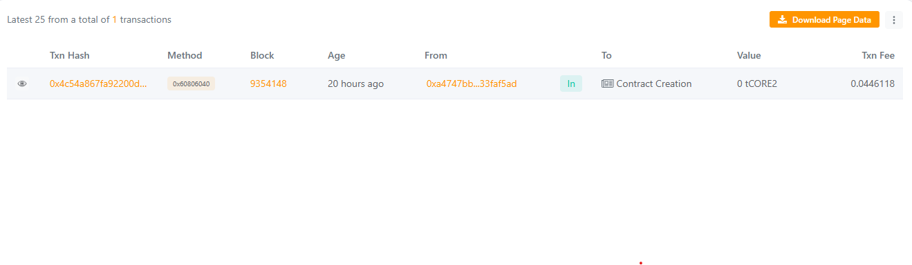

# Cryptura Protocol

## Project Description
Cryptura Protocol Labs is an innovative smart contract project aimed at securely storing, retrieving, and manipulating data on the Ethereum blockchain. This project provides a foundation for decentralized data management and further blockchain-based applications.

## Project Vision
To create a decentralized protocol that ensures secure, transparent, and efficient management of on-chain data while enabling developers to build scalable applications on top of it.

## Key Features
- **Data Storage:** Store data securely on-chain.
- **Data Retrieval:** Access stored data anytime.
- **Data Increment:** Update stored data with secure access control.
- **Ownership:** Only the contract owner can modify the data.
- **Event Logging:** Emits events for every important action.

## Future Scope
- Integration with other decentralized finance (DeFi) protocols.
- Expansion to multi-user data storage and access.
- Off-chain analytics integration with on-chain data.
- Implement advanced security features like multi-signature access.
- Explore interoperability with other blockchain networks.

## Contract Address

Contract Address - 0x68392a56F7D857776BCb2b0a751Cb3d927d84840
